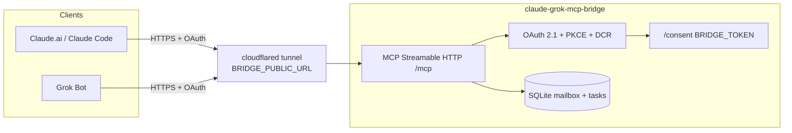

# Claude ↔ Grok MCP Bridge

Bidirectional **MCP** bridge: a shared mailbox and task board so **Claude** and **Grok Bot** can leave messages and tracked work for each other.

## Architecture



- **HTTP mode**: Streamable HTTP at `/mcp`, OAuth 2.1 (authorization code + PKCE), dynamic client registration, consent page gated by `BRIDGE_TOKEN`.
- **stdio mode**: Local Claude Code transport (no OAuth); same tools against the same SQLite DB.

## Quick start

```bash
cd claude-grok-mcp-bridge
cp .env.example .env
# edit BRIDGE_TOKEN and BRIDGE_PUBLIC_URL

uv sync --group dev
uv run claude-grok-mcp-bridge http
# → listens on BRIDGE_HOST:BRIDGE_PORT (default 0.0.0.0:8792)
```

Health check:

```bash
curl -s http://127.0.0.1:8792/health
# {"ok":true}
```

Tests:

```bash
uv run pytest -q
```

## Environment variables

| Variable | Default | Description |
|----------|---------|-------------|
| `BRIDGE_TOKEN` | *(required in prod)* | Shared secret entered on `/consent` |
| `BRIDGE_HOST` | `0.0.0.0` | Bind address |
| `BRIDGE_PORT` | `8792` | HTTP port |
| `BRIDGE_PUBLIC_URL` | `http://127.0.0.1:8792` | Public base URL (issuer + resource metadata) |
| `BRIDGE_DB_PATH` | `data/bridge.db` | SQLite file |

See `.env.example`.

## Expose with cloudflared

```bash
# Terminal 1 — bridge
uv run claude-grok-mcp-bridge http

# Terminal 2 — tunnel
cloudflared tunnel --url http://127.0.0.1:8792
```

Copy the `https://….trycloudflare.com` URL into `.env`:

```bash
BRIDGE_PUBLIC_URL=https://YOUR-SUBDOMAIN.trycloudflare.com
```

Restart the bridge so OAuth issuer / resource metadata match the tunnel.

## Connect Grok Bot

1. Open [grok.com/connectors](https://grok.com/connectors).
2. Add a **Custom** connector.
3. MCP URL: `https://YOUR-HOST/mcp` (must match `BRIDGE_PUBLIC_URL` + `/mcp`).
4. Complete OAuth; on `/consent` enter your `BRIDGE_TOKEN`.
5. Always call tools with `as_side="grok"`. See `SKILL.md`.

## Connect Claude.ai custom connector

1. Claude.ai → Settings → Connectors → **Custom**.
2. Server URL: `https://YOUR-HOST/mcp`.
3. Authorize; enter `BRIDGE_TOKEN` on the consent page.
4. Use `as_side="claude"` on write tools.

Redirect hosts allowlisted for DCR include `claude.ai`, `claude.com`, `grok.com`, `x.ai`, and localhost.

## Claude Code (stdio + HTTP)

**stdio** (local, no OAuth):

```bash
claude mcp add claude-grok-bridge -- uv run --directory /path/to/claude-grok-mcp-bridge claude-grok-mcp-bridge stdio
```

**HTTP** (remote / tunnel, OAuth):

```bash
claude mcp add --transport http claude-grok-bridge https://YOUR-HOST/mcp
```

## MCP tools

| Tool | Purpose |
|------|---------|
| `bridge_status` | Health + unread / task counters |
| `send_message` | Mailbox note (`to`, `subject`, `body`, `as_side`) |
| `list_messages` / `get_message` / `reply_message` / `mark_read` | Read & reply |
| `create_task` / `list_tasks` / `update_task` | Task board |

Guidance for agents: **`SKILL.md`** (`send_message` vs `create_task`, polling, always set `as_side`).

## License

MIT — see `LICENSE`.
