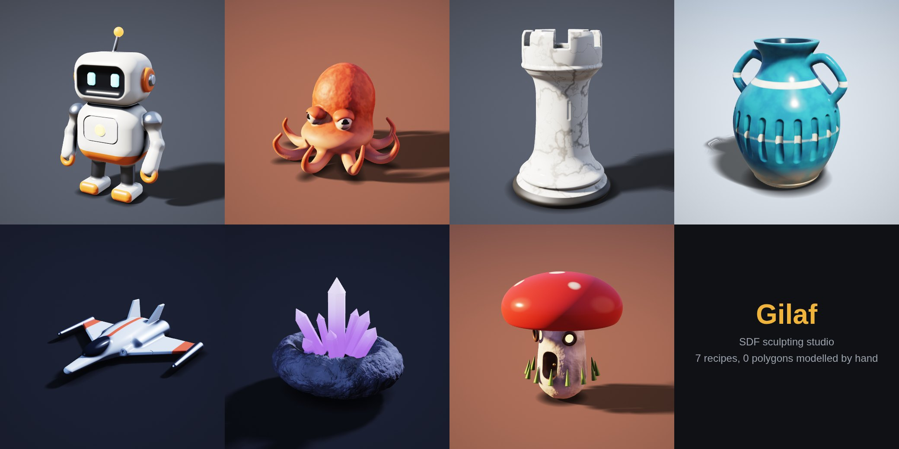

# גילוף · Gilaf SDF Studio

פיסול מודלים בתלת־ממד במתמטיקה של **שדות מרחק (Signed Distance Fields)**: כותבים "מתכון" קצר, רואים אותו מיד בתאורת סטודיו, ומייצאים קובץ GLB למשחקים ולבלנדר או STL להדפסה בתלת־ממד.



למה דווקא ככה, ומה עוד קיים היום: [docs/research.md](docs/research.md).

## שלוש דרכים לעבוד

**1. בדפדפן, בלי התקנה.** פתחו את [הסטודיו ב־claude.ai](https://claude.ai/artifact/KMpFmzj8DMkK9jE233dKFJ) (פרטי, רק לבעלים ולמי ששיתפו), או את `dist/gilaf.html` מקומית (קובץ אחד, עובד גם בלי אינטרנט). בחרו דוגמה, שנו מספרים בקוד או בסליידרים, וייצאו בלשונית "ייצוא".

**2. עם Claude בתוך הסטודיו.** כשהסטודיו פתוח ב־claude.ai, בלשונית Claude כותבים "דרקון קטן יושב על סלע", ו־Claude כותב את המתכון. "שפר" שולח ל־Claude גם תמונה של המודל מארבע זוויות, כדי שיראה מה לתקן.

**3. עם Claude Code.** בקשו "צור מודל תלת־ממד של…". הסקיל `gilaf-sdf` כותב מתכון, מרנדר, מסתכל על התוצאה, מבקר ומשפר כמה סבבים, ומייצא קבצים. זו הדרך לתוצאות הכי טובות.

## מתכון לדוגמה

```js
const head = sphere(0.5).color('#f2c9a0', 'satin');
const ear = ellipsoid(0.12, 0.2, 0.06).move(0.42, 0.3, 0);
const eye = sphere(0.07).move(0.18, 0.1, 0.44).color('#1a1a1a', 'glossy');
return head
  .add(ear.mirror('x'), 0.08)     // אוזניים מומסות לראש, סימטריות
  .add(eye.mirror('x'), 0.01);
```

שפת המתכונים המלאה וכללי המלאכה: [docs/recipe-reference.md](docs/recipe-reference.md).

## שורת הפקודה

```bash
node tools/gilaf.mjs check  recipes/robot.js                         # בדיקת תקינות
node tools/gilaf.mjs render recipes/robot.js --out robot.png        # 4 זוויות בתמונה אחת
node tools/gilaf.mjs render recipes/robot.js --clay                 # צורה בלבד, בלי צבע
node tools/gilaf.mjs still  recipes/robot.js --yaw 30 --pitch 15    # תמונה אחת
node tools/gilaf.mjs export recipes/robot.js --out robot.glb --res 256 --tris 100000
node tools/gilaf.mjs export recipes/rook.js  --out rook.stl --res 320 --mm 60
node tools/build.mjs                                                 # בנייה מחדש של dist/
```

צריך Node 18 ומעלה ו־Playwright עם Chromium (`npm i -g playwright && npx playwright install chromium`).

## מה יוצא בייצוא

| פורמט | בשביל | מה בפנים |
|---|---|---|
| GLB | Blender, Three.js, Unity, Unreal, Godot | רשת משולשים, נורמלים, צבע לכל קודקוד, חומרים (חספוס, מתכת, זוהר) |
| STL | הדפסה בתלת־ממד | ציר Z למעלה, עומד על המשטח, בגודל שבחרתם במ״מ, גוף סגור |
| OBJ | כלים ישנים | רשת עם צבע לכל קודקוד |

בתוך claude.ai הקבצים יורדים כ־ZIP (יחד עם המתכון), כי הצופה שם מתיר רק סוגי קבצים מסוימים.

## הדוגמאות

| מתכון | מה הוא מדגים |
|---|---|
| `robot.js` | צורות קשיחות מעוגלות, כיס מסך מבריק, עיניים זוהרות, סימטריה, חריצי אוורור עם `grid` |
| `octopus.js` | צורה אורגנית: זרועות `tube` ספליין, `ring(8)`, עור מנומר, מעבר צבע לבטן |
| `rook.js` | `lathe` חריטה, צריחים מ־`ring`, שיש עם גידים (`colorNoise` עם `veins`) |
| `vase.js` | כלי חלול ופתוח (`shell` + `halfspace`), חריצים, ידיות ספליין, זיגוג בפסים |
| `spaceship.js` | כנפיים מפוליגון עם `extrude`, תפרי פנלים, מנועים זוהרים |
| `crystals.js` | סלע עם רעש `ridged`, קריסטלים משושים בפיזור אקראי קבוע (`rand`) |
| `mushroom.js` | דלת חרוטה שנצבעת מהחורט, חלונות מאירים, נקודות צבועות |

קובצי GLB מוכנים של כל הדוגמאות נמצאים ב־`examples/`.

## מבנה הפרויקט

```
src/dsl.js        שפת המתכונים וחישוב תיבות חוסמות
src/glsl.js       מהדר מתכון → GLSL
src/renderer.js   תצוגה בזמן אמת (raymarching) ותצוגת רשת
src/mesher.js     שדה מרחק → רשת משולשים על ה־GPU, צמצום משולשים
src/export.js     כתיבת GLB / STL / OBJ / ZIP
src/ai.js         הנחיות ל־Claude (יצירה, שיפור, תיקון)
src/app.js        הממשק
src/app.html      עיצוב ומבנה הדף
tools/build.mjs   אורז הכול לקובץ HTML יחיד ב־dist/
tools/gilaf.mjs   שורת פקודה (Chromium בלי מסך)
recipes/          מתכוני הדוגמה
vendor/           meshoptimizer (MIT)
```

## מגבלות

- קצוות חדים מאוד מתעגלים מעט בייצוא (בגודל תא רשת אחד). רזולוציה גבוהה יותר מקטינה את זה.
- `displace` חזק, `twist` ו־`bend` הופכים את השדה ללא מדויק, ולכן התצוגה איטית יותר ואולי יופיעו פסים. ערכים מתונים עובדים מצוין.
- הצבע נשמר לכל קודקוד, בלי טקסטורת UV. בייצוא ברזולוציה 256 ומעלה זה נראה חלק.
