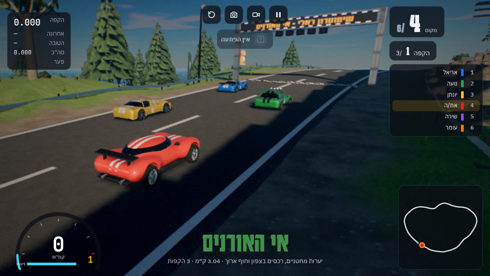
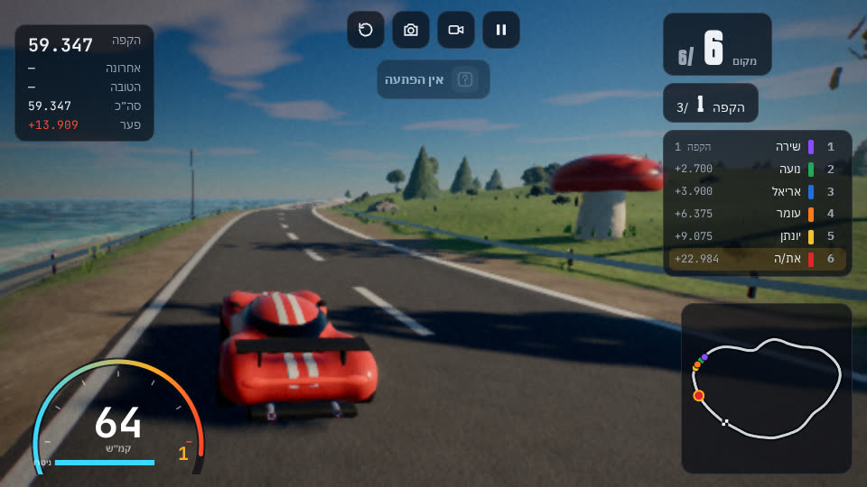

# גילוף בתוך שימוטרון ראלי

`patch.py` לוקח את קובץ המשחק (HTML יחיד) ומוסיף לו מודלים מגילוף:

- **גילוף GT** במוסך: מכונית שנפסלה ב־`recipes/car.js`, עם גלגלים מסתובבים, צבע שמשתנה לפי בחירה, פנסים ואורות בלמים שנדלקים.
- **כלבלב מונפש** ליד שער הזינוק בכל מסלול. הוא מכשכש, מטה את הראש ומצמץ.
- **בתי פטרייה וסלעי קריסטלים** לאורך השוליים, מחוץ למעקות. הם לא מוצבים במנהרות, בקטעים מקורים או בפתחים במעקה.





```bash
python3 patch.py rally.html rally-gilaf.html
```

הסקריפט עובד על עותק, ולא משנה את הקובץ המקורי. כל שינוי נצמד לקטע קוד מדויק בקובץ המשחק. אם המשחק ישתנה, הסקריפט יעצור ויראה איזה קטע כבר לא נמצא, במקום לכתוב קובץ שבור.

## ייצוא המודלים מחדש

אחרי שינוי במתכון, מתיקיית `gilaf-sdf`:

```bash
node tools/gilaf.mjs export recipes/car.js      --out integrations/shimotron-rally/models/gilaf-car.glb --res 320 --tris 50000 --lo 10000
node tools/gilaf.mjs export recipes/dog.js      --out integrations/shimotron-rally/models/dog.glb       --res 192 --tris 12000
node tools/gilaf.mjs export recipes/mushroom.js --out integrations/shimotron-rally/models/mushroom.glb  --res 160 --tris 6000
node tools/gilaf.mjs export recipes/crystals.js --out integrations/shimotron-rally/models/crystals.glb  --res 160 --tris 6000
```

## מה המשחק מצפה למצוא במכונית

| במודל | בשביל מה |
|---|---|
| צמתים `WheelFrontL`, `WheelFrontR`, `WheelRearL`, `WheelRearR` (L בצד +X) | הגלגלים מסתובבים ופונים בהיגוי |
| בכל גלגל, רשת ששמה מכיל `Tire` | מרכז הצמיג הוא ציר הסיבוב של הגלגל. בלי צמיג המשחק לא טוען את המכונית |
| חומר `Paint 1 Carmine` | הצבע שנבחר במוסך (חובה) |
| חומרים `Headlight`, `Brakelight` | פנסים ואורות בלמים שנדלקים (חובה) |
| מטרים, +Z קדימה, Y למעלה | אותו גודל ואותו כיוון כמו שאר המכוניות |

המפרט של המכונית (משקל, גלגלים, מנוע, תיבת ההתנגשות) כתוב ב־`patch.py` לפי מידות המודל. צורת הצללית במוסך לקוחה ממכונית הקונספט.
