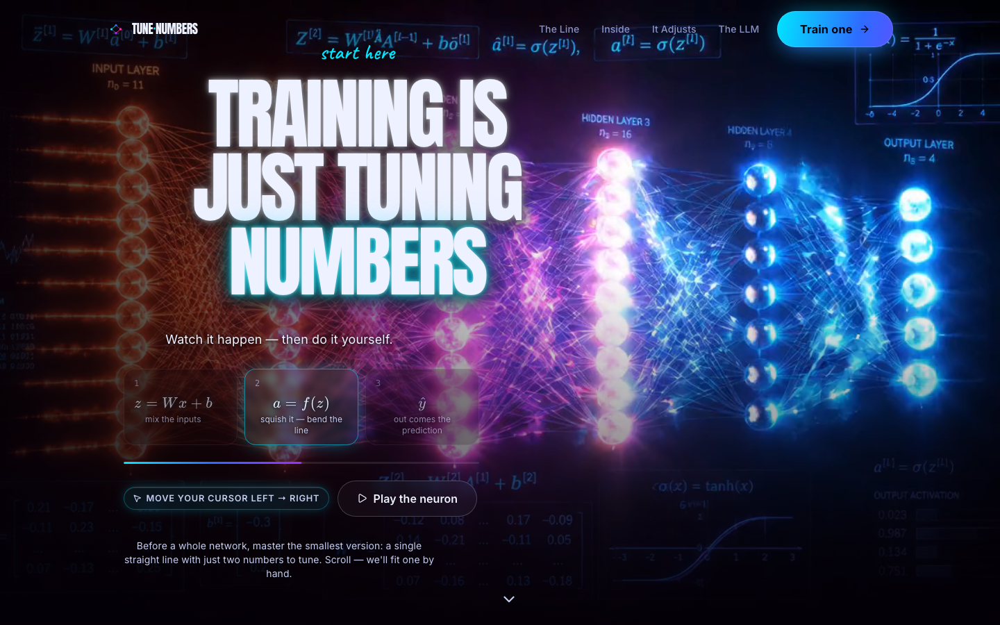
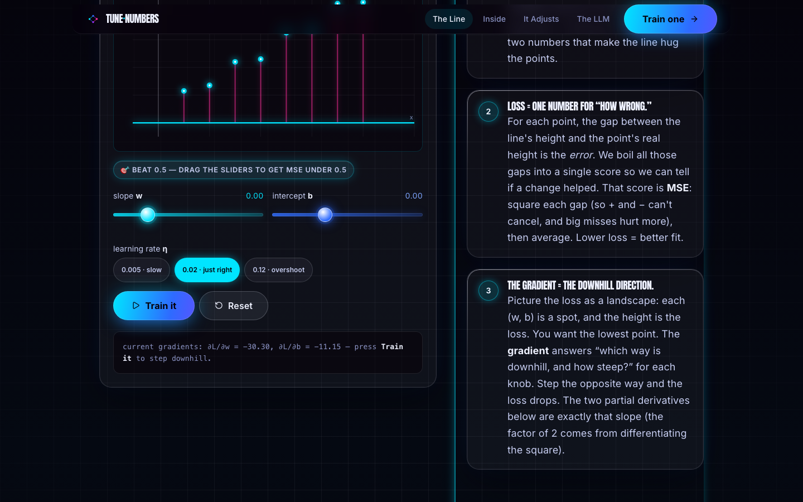
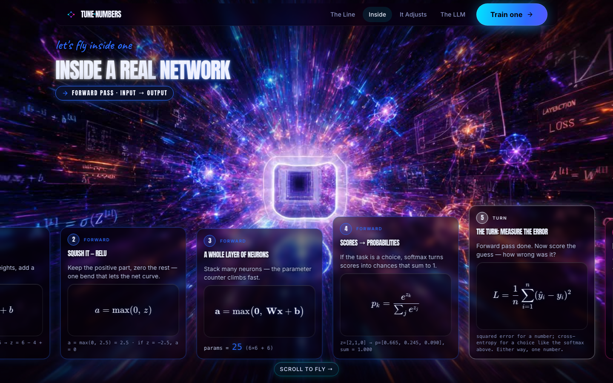
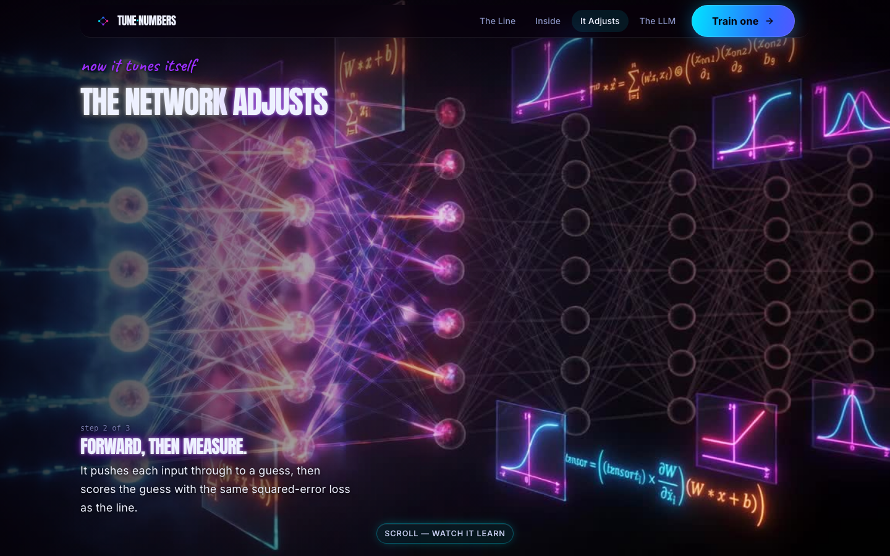
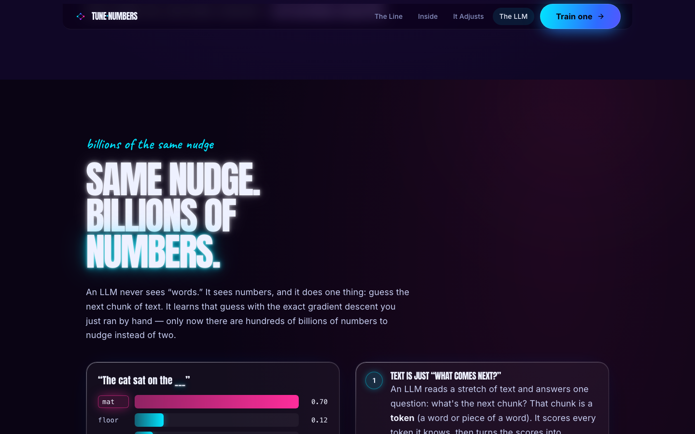
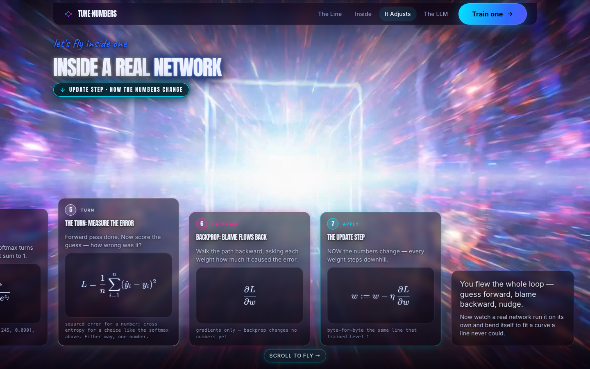
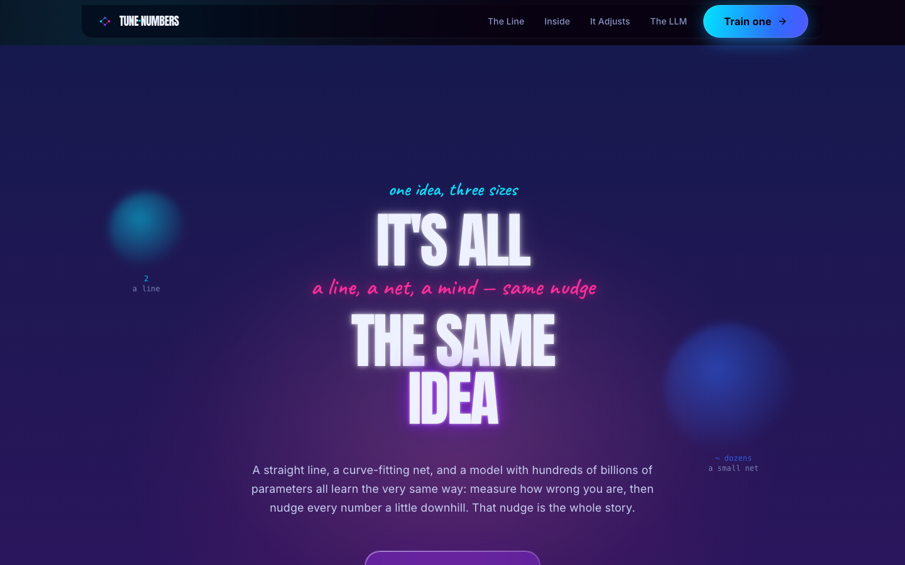
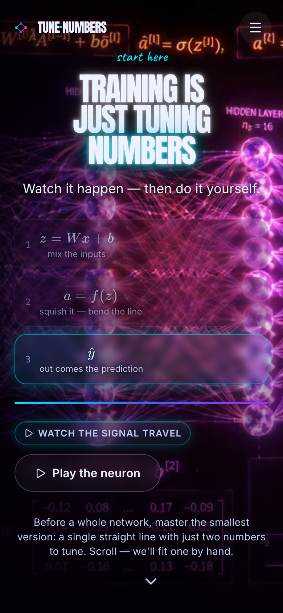
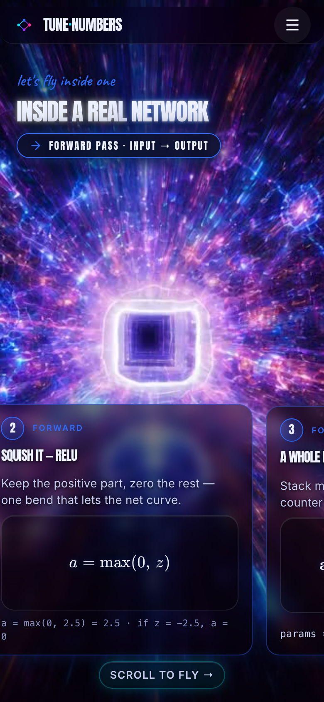

# Training Is Just Tuning Numbers

### A scroll-driven, hands-on lesson on how neural networks train — and how the *exact same* idea scales up to a large language model.

[](https://github.com/hoodini/tuning-numbers/actions/workflows/deploy.yml)
&nbsp;·&nbsp; **Live demo → https://hoodini.github.io/tuning-numbers/**
&nbsp;·&nbsp; License: MIT

> One thesis, shown at three zoom levels: **training = adjusting numbers (parameters) until the math fits the data.** A 2-parameter line, a small neural net that bends into a curve, and an LLM with hundreds of billions of parameters all learn with the *same* gradient-descent step — `θ := θ − η · ∂L/∂θ`. Every interactive runs the **real math in your browser** (gradient-checked), never faked.



---

## The journey (six beats)

| Beat | What you see | Real math? |
|---|---|---|
| **Hero** | A neural network lights up as your **cursor scrubs** the video; three KaTeX chips walk one neuron's forward pass (`z = Wx + b → a = f(z) → ŷ`). | — |
| **Level 1 — Solve it by training** | Drag two sliders to fit a line; watch the live **MSE**, the per-point error sticks, beat the `0.5` mini-game, then hit **Train** and watch real gradient descent run itself downhill (with a learning-rate **overshoot** demo). | ✅ MSE + analytic gradients + GD |
| **Inside a real network** (FPV) | A horizontal, pinned **flythrough** — station by station — that correctly names the three operations: **forward pass → backprop → update step**. | ✅ worked numbers per station |
| **The network adjusts** (Level 2) | A `1→6→6→1` net learns to trace a **sine** a straight line never could: live forward + **backprop**, a plotting loss curve, and neurons that glow by activation. | ✅ full forward + backprop + GD |
| **This is how an LLM works** (Level 3) | A live `softmax` bar chart over "The cat sat on the ___", an animated scale counter (2 → hundreds of billions), and a real **one-step** `floor → mat` cross-entropy nudge. | ✅ softmax + cross-entropy + `p − onehot` |
| **It's all the same idea** | The finale — the one update rule, one last time. | — |

<table>
  <tr>
    <td width="50%"><br/><sub><b>Level 1 lab</b> — real MSE, error sticks, gradient descent</sub></td>
    <td width="50%"><br/><sub><b>FPV flythrough</b> — forward pass, station by station</sub></td>
  </tr>
  <tr>
    <td width="50%"><br/><sub><b>The network adjusts</b> — nn2 scroll-scrub backdrop</sub></td>
    <td width="50%"><br/><sub><b>LLM</b> — live softmax, scale counter, one real step</sub></td>
  </tr>
  <tr>
    <td width="50%"><br/><sub><b>Forward → backprop → update</b>, each labeled correctly</sub></td>
    <td width="50%"><br/><sub><b>Finale</b> — one mechanism, three scales</sub></td>
  </tr>
</table>

<p align="center"> &nbsp; </p>
<p align="center"><sub>Fully responsive — the footage stays the star on phones too.</sub></p>

---

## Everything runs real math

All interactive math lives in [`site/src/lib/ml.ts`](site/src/lib/ml.ts) and is computed honestly in JavaScript — `forward()`, `backward()` (gradients only), and `step()` are kept strictly separate so the three operations are never conflated. It ships a finite-difference **gradient checker** (`runMathSelfTest()`, logged in dev) so correctness is verifiable, not asserted:

```
linreg gradient           PASS  (maxRelErr ≈ 1.6e-10)
mlp backprop              PASS  (maxRelErr ≈ 2.6e-9)
softmax x-entropy grad    PASS  (maxRelErr ≈ 9.9e-10)
```

The worked examples on the page reproduce these exactly (e.g. Level 1 loss `41.0 → 28.45` in one step; the LLM nudge raises `p(mat)` `0.24 → 0.37` and drops `p(floor)` `0.64 → 0.50`). Any illustrative/hand-picked numbers (the LLM logit tables) are clearly labelled **illustrative** in the UI.

---

## Tech stack

- **Vite + React + TypeScript + Tailwind CSS v3**
- **GSAP + ScrollTrigger** for pinned, scrubbed sections
- **Lenis** smooth scrolling (synced to ScrollTrigger; disabled under reduced-motion)
- **KaTeX** for all equations
- **lucide-react** icons
- Two scroll techniques: a **mouse-scrub video hero** (the hero `<video>` re-encoded so every frame is a keyframe) and **canvas frame-scrub** sections (a ported `FrameScrubber` lerping the frame index from scroll progress)

Cosmic-neon, cool-dominant palette — bg `#050008`; blue `#2E6BFF` / cyan `#00E5FF` / purple `#9B30FF`; pink `#FF2D9B` + orange `#FF7A1A` as sparing accents; cream `#EEF1FF` text (never pure white). Type: **Anton** (display), **Inter** (body), **Caveat** (handwritten accent).

---

## Run it locally

```bash
cd site
npm install
npm run dev      # http://localhost:5173
```

Build a static bundle (what gets deployed):

```bash
npm run build    # outputs to site/dist
npm run preview  # preview the production build
```

The app's web-ready assets (`hero.mp4` + the `fpv` / `nn2` JPEG frame sequences) are committed under [`site/public/`](site/public) so it runs and deploys with no extra processing.

---

## How the video assets were made

Three short 1280×720 clips were processed with `ffmpeg`:

```bash
# Hero: re-encode so EVERY frame is a keyframe → buttery mouse-scrub seeking
ffmpeg -y -i nn.mp4 -g 1 -keyint_min 1 -c:v libx264 -preset slow -crf 20 -pix_fmt yuv420p -an site/public/hero.mp4

# FPV & nn2: decimate to ~12 fps and extract JPEG frames for the canvas scrubbers
ffmpeg -y -i fpv.mp4 -vf "fps=12,scale=1280:-2" -q:v 6 site/public/frames/fpv/frame-%03d.jpg
ffmpeg -y -i nn2.mp4 -vf "fps=12,scale=1280:-2" -q:v 6 site/public/frames/nn2/frame-%03d.jpg
```

Drop your own clips in and re-run to reskin it. If a video is missing, the matching section falls back gracefully.

---

## Deployment

Pushing to `main` triggers [`.github/workflows/deploy.yml`](.github/workflows/deploy.yml), which builds the Vite app and publishes `site/dist` to **GitHub Pages**. The build uses a relative base (`base: "./"`) and a small [`asset()`](site/src/lib/asset.ts) helper, so it works at the domain root, under a Pages subpath, or on any static host — no repo-name hardcoding.

## Accessibility & performance

- Respects `prefers-reduced-motion` everywhere — every scrub/pin/animation has a real calm fallback (static stacks, no auto-motion).
- Keyboard-navigable with visible focus rings, a skip-to-content link, `aria-live` on the live numbers, and ≥44px touch targets.
- Heavy frame sequences lazy-load only as their section approaches the viewport; canvases cap at `devicePixelRatio ≤ 2`.

---

## Credits

Built by **Yuval Avidani** — an AI educator.

🔗 [yuv.ai](https://yuv.ai) · 𝕏 [@yuvalav](https://x.com/yuvalav) · GitHub [@hoodini](https://github.com/hoodini) · YouTube [@yuv-ai](https://youtube.com/@yuv-ai)

Scaffolded with the open-source [`cinematic-scrub-landing`](https://github.com/hoodini/ai-agents-skills) and [`parallax-landing-page`](https://github.com/hoodini/ai-agents-skills) skills.

## License

[MIT](LICENSE) © 2026 Yuval Avidani
